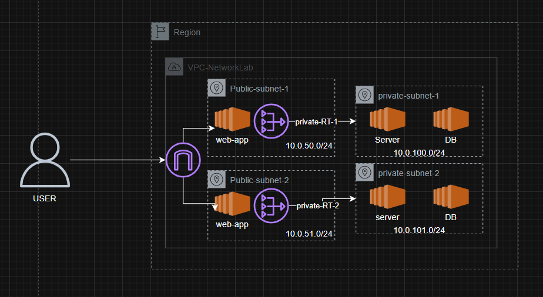

# AWS SAA Network Lab Design

<<<<<<< HEAD

=======

>>>>>>> 90312b3 (feat: implement VPC endpoints architecture with private EC2 using Terraform)

## About

Simple AWS SAA network lab design for Terraform practice.

This project creates a highly available AWS network using Terraform with a VPC, public and private subnets, an Internet Gateway, NAT Gateways, and route tables.

## Design

- VPC in one region
- 2 public subnets across 2 AZs
- 2 private subnets across 2 AZs
- Internet Gateway for public subnet routing
- NAT Gateways in each public subnet for outbound access from private subnets

## Terraform layout

- `terraform/main.tf` - network resources and routing
- `terraform/variables.tf` - input variables
- `terraform/outputs.tf` - exported resource IDs

## Notes

The design is intended for AWS SAA practice and demonstrates a simple highly available network topology.
