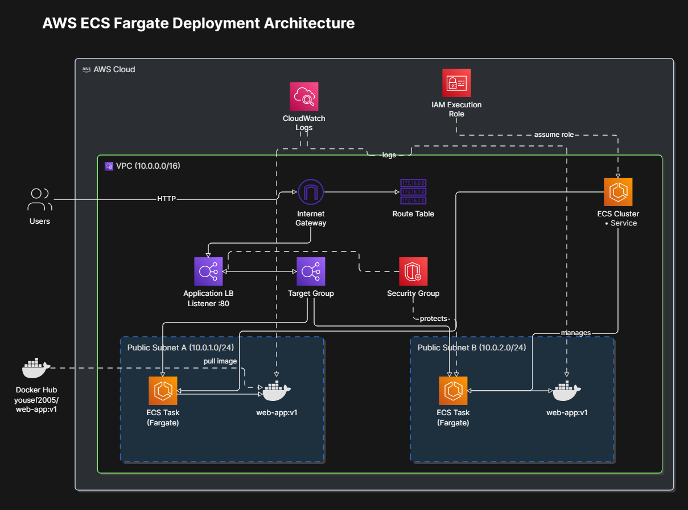
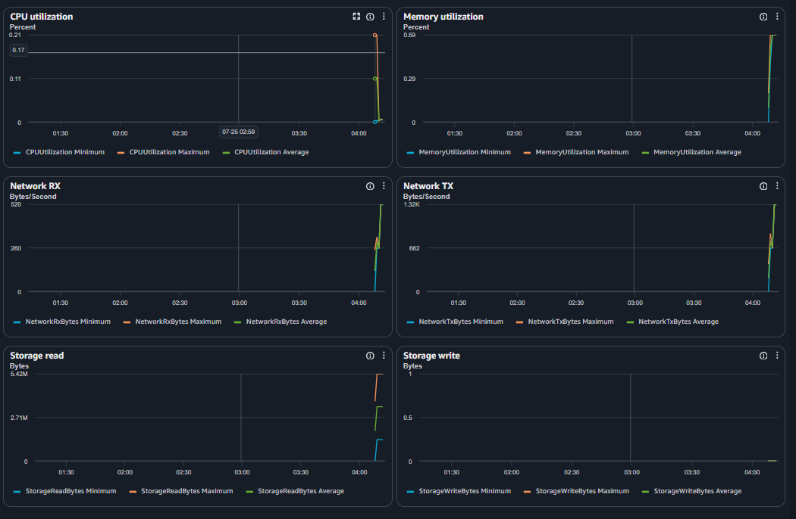
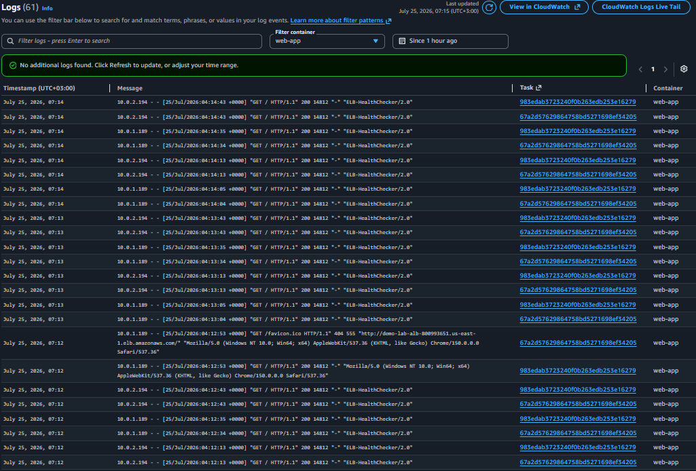

# demo-lab — AWS ECS Fargate Deployment (Terraform)




This project deploys a small, production-style **ECS Fargate** web app behind an
**Application Load Balancer**, inside a new **VPC** with 2 public subnets.
The container image is pulled straight from Docker Hub (`yousef2005/web-app:v1`).

Only 4 Terraform files are used, as requested:

| File | Purpose |
|---|---|
| `main.tf` | All AWS resources (VPC, subnets, IGW, route table, SG, IAM role, ECS, ALB, CloudWatch) |
| `variables.tf` | Input variable definitions |
| `terraform.tfvars` | Actual values used for this deployment |
| `outputs.tf` | Useful outputs (ALB URL, cluster name, role ARN, etc.) |

## How it works (simple flow)

1. **Users** hit the **ALB** over HTTP (port 80).
2. The ALB **Listener** forwards traffic to the **Target Group**.
3. The Target Group routes to **ECS Tasks** (Fargate) running in **2 public subnets**.
4. Each task pulls the image `yousef2005/web-app:v1` from **Docker Hub**, using the
   **IAM Execution Role** to authenticate/pull and to write logs.
5. Container logs stream to **CloudWatch Logs**.
6. The **ECS Service** keeps the desired number of tasks running and manages
   registration with the target group.

# Health Checks & Metrics


# Container Logs


## Resource table (with AWS SAA exam tips)

| # | Resource | Terraform Type | What it does | SAA-C03 tip |
|---|---|---|---|---|
| 1 | VPC | `aws_vpc` | Isolated network, `10.0.0.0/16` | Know CIDR sizing; a `/16` gives 65,536 IPs, subnets carve it up. |
| 2 | Public Subnets (x2) | `aws_subnet` | Two subnets in two AZs for HA | Always spread resources across **2+ AZs** for high availability — a classic exam theme. |
| 3 | Internet Gateway | `aws_internet_gateway` | Gives the VPC internet access | One IGW per VPC; it's the target for `0.0.0.0/0` in a **public** route table. |
| 4 | Route Table | `aws_route_table` + association | Routes `0.0.0.0/0` → IGW | A subnet is only "public" because its route table sends internet traffic to an IGW — not because of naming. |
| 5 | Security Group | `aws_security_group` | Stateful firewall for ALB & tasks | SGs are **stateful** (return traffic auto-allowed) vs NACLs which are **stateless**. |
| 6 | IAM Execution Role | `aws_iam_role` | Lets ECS pull the image & push logs | This is the **task execution role**, different from a **task role** (which gives the app itself AWS permissions). Exam loves this distinction. |
| 7 | ECS Cluster | `aws_ecs_cluster` | Logical grouping for services/tasks | With Fargate you don't manage EC2 capacity — no ASG, no instances to patch. |
| 8 | ECS Task Definition | `aws_ecs_task_definition` | Blueprint: image, CPU/mem, ports, logging | Fargate CPU/memory combos are fixed pairs (e.g. 256 CPU → 512/1024/2048 MB). |
| 9 | ECS Service | `aws_ecs_service` | Keeps desired task count running, registers with ALB | Handles rolling deployments and self-healing if a task dies. |
| 10 | Application Load Balancer | `aws_lb` | Layer-7 load balancer, public facing | ALB = HTTP/HTTPS + path/host routing. Use NLB instead for raw TCP/UDP or extreme performance. |
| 11 | Target Group | `aws_lb_target_group` | Health-checks & routes to tasks (`target_type = ip`) | Fargate tasks use **IP target type** (not instance), since there's no EC2 instance ID. |
| 12 | Listener | `aws_lb_listener` | Accepts traffic on port 80, forwards to target group | Add a second listener on 443 + ACM cert for HTTPS in real deployments. |
| 13 | CloudWatch Logs | `aws_cloudwatch_log_group` | Centralized container logs | Set `retention_in_days` explicitly — default is "never expire" (costs add up). |
| 14 | Docker Hub Image | `yousef2005/web-app:v1` | Application container | For production, prefer **ECR** (private, integrated with IAM, image scanning) over public Docker Hub. |

## Usage

```bash
terraform init
terraform plan
terraform apply
```

After apply, open the ALB URL from the output:

```bash
terraform output alb_dns_name
```

To tear everything down:

```bash
terraform destroy
```

## Notes / things to adjust before using in a real environment

- Add an HTTPS listener (ACM certificate) instead of plain HTTP.
- Move the container image to **Amazon ECR** instead of Docker Hub.
- Tighten the security group to your needs (currently open to `0.0.0.0/0` on port 80).
- Consider private subnets + NAT Gateway for the tasks, with the ALB only in public subnets, for a more locked-down design.


## ⚠️ Cost warning — this is NOT Free Tier
 
This lab uses several resources that are **billed from the first minute**, even in a
brand-new AWS account. Don't forget to `terraform destroy` when you're done testing.
 
| Resource | Free Tier? | Approx. cost driver |
|---|---|---|
| **ALB (Application Load Balancer)** | ❌ No | Billed hourly + per LCU, regardless of traffic — this is usually the biggest surprise cost. |
| **Fargate tasks** | ❌ No | Billed per vCPU/memory per second while `RUNNING` — 2 tasks running 24/7 add up fast. |
| **NAT Gateway** (if you add private subnets, see note above) | ❌ No | Hourly charge **+ per-GB data processing** — one of the most expensive small resources on AWS. |
| **CloudWatch Logs** | ⚠️ Partial | 5 GB ingestion/storage free per month, then billed per GB — fine for a demo, watch `log_retention_days`. |
| **Data transfer out (to the internet)** | ⚠️ Partial | First 100 GB/month free account-wide, then billed per GB. |
| VPC, Subnets, Internet Gateway, Route Table, Security Group, IAM Role | ✅ Free | No charge for these on their own. |
 
**Rule of thumb:** the moment `terraform apply` finishes, the ALB and the 2 Fargate
tasks start costing money per hour — there's no "idle = free" mode like Lambda has.
For a short demo, run `terraform destroy` right after you're done testing.


