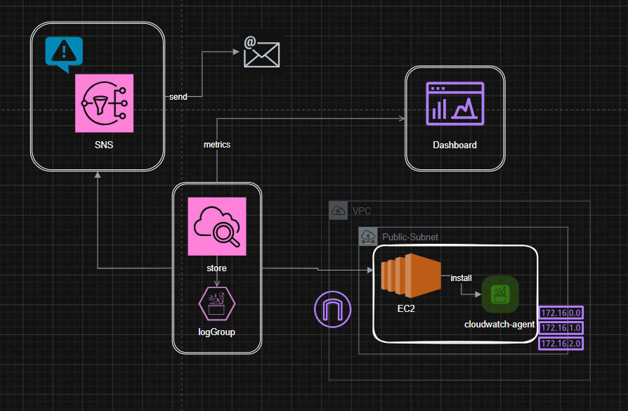

# CloudWatch-Terraform — AWS Monitoring & Alerting Infrastructure



## Overview

This Terraform project provisions a complete, production-style AWS environment consisting of a custom
VPC, a publicly accessible EC2 web server, and an end-to-end CloudWatch monitoring and alerting pipeline
that notifies an operator by email when CPU utilization spikes. It mirrors the architecture diagram above:

1. An **EC2 instance** running **Nginx** sits inside a **Public Subnet** of a custom **VPC**.
2. The **CloudWatch Agent** is installed and configured on the instance to ship logs (`/var/log/messages`,
   Nginx access/error logs) to a **CloudWatch Log Group**, and metrics to CloudWatch.
3. A **CloudWatch Metric Alarm** (`high-cpu-alarm`) watches `CPUUtilization` and fires when it is
   `>= 50%` for one 60-second period.
4. The alarm **publishes to an SNS Topic**, which has an **email subscription**, so an operator is
   notified by email (`send` in the diagram).
5. All key metrics (CPU, Network In/Out, Status Check Failed, Disk Read/Write) are visualized on a
   **CloudWatch Dashboard** (`production-dashboard`).

## Project Structure

Only three Terraform files are used, as required:

| File | Purpose |
|---|---|
| `main.tf` | All AWS resources: networking, security group, IAM, EC2, CloudWatch, SNS |
| `variables.tf` | All input variables with sensible defaults |
| `outputs.tf` | All output values (IDs, ARNs, DNS names, etc.) |

`design.png` is the original design image, included here purely for reference — it is not
read by Terraform.

## What Gets Created

### Networking
- **Custom VPC** (`aws_vpc.main`) — default CIDR `172.16.0.0/16`, matching the `172.16.x.x` addressing
  shown in the diagram.
- **Public Subnet** (`aws_subnet.public`) — `map_public_ip_on_launch = true` so instances get a public
  IP automatically.
- **Internet Gateway** (`aws_internet_gateway.main`) — provides internet connectivity.
- **Public Route Table** (`aws_route_table.public`) — routes `0.0.0.0/0` to the Internet Gateway, and is
  associated with the public subnet via `aws_route_table_association.public`.

### Compute & Security
- **Security Group** (`aws_security_group.ec2_sg`) — inbound `22` (SSH), `80` (HTTP), `443` (HTTPS), and
  unrestricted egress.
- **EC2 Instance** (`aws_instance.web`) — Amazon Linux 2023 (resolved dynamically via the
  `data "aws_ami" "amazon_linux_2023"` data source — no hardcoded AMI ID), `t3.micro`, with a public IP
  and the CloudWatch Agent IAM instance profile attached.
- **User Data script** — runs on first boot to:
  - Update the OS (`dnf update -y`)
  - Install, enable, and start **Nginx**
  - Install the **Amazon CloudWatch Agent**
  - Write `amazon-cloudwatch-agent.json`, pointing log collection at `/var/log/messages`,
    `/var/log/nginx/access.log`, and `/var/log/nginx/error.log`
  - Start the agent via `amazon-cloudwatch-agent-ctl -a fetch-config -m ec2 -s`
  - `systemctl enable amazon-cloudwatch-agent` so it **survives reboots**

### IAM
- **IAM Role** (`aws_iam_role.ec2_role`) — trusted by `ec2.amazonaws.com`.
- **Managed Policy Attachment** — `CloudWatchAgentServerPolicy`, giving the instance permission to push
  logs/metrics.
- **Instance Profile** (`aws_iam_instance_profile.ec2_profile`) — attached to the EC2 instance.

### Monitoring & Alerting
- **CloudWatch Log Group** — `my-ec2-log-group`, 7-day retention.
- **CloudWatch Metric Alarm** — `high-cpu-alarm`, `AWS/EC2 / CPUUtilization`, `Average`, `period = 60`,
  `evaluation_periods = 1`, `threshold >= 50` (configurable via `alarm_threshold`).
- **SNS Topic** (`aws_sns_topic.alerts`) — alarm actions publish here.
- **SNS Email Subscription** — `ya1770620@gmail.com` (configurable via `email_address`).
  > ⚠️ AWS sends a confirmation email after `apply`. The subscription stays in `PendingConfirmation`
  > until the link in that email is clicked — no notifications are delivered before that.
- **CloudWatch Dashboard** — `production-dashboard`, with widgets for `CPUUtilization`, `NetworkIn`,
  `NetworkOut`, `StatusCheckFailed`, `DiskReadBytes`, and `DiskWriteBytes`.

### Tagging
Every taggable resource receives:
```
Project     = "CloudWatch-Terraform"
Environment = "Dev"
ManagedBy   = "Terraform"
```
applied via the `local.common_tags` map in `main.tf`.

## Variables (`variables.tf`)

| Variable | Description | Default |
|---|---|---|
| `aws_region` | AWS region | `us-east-1` |
| `vpc_cidr` | VPC CIDR block | `172.16.0.0/16` |
| `public_subnet_cidr` | Public subnet CIDR block | `172.16.1.0/24` |
| `availability_zone` | AZ for subnet/instance | `us-east-1a` |
| `instance_type` | EC2 instance type | `t3.micro` |
| `key_pair_name` | Existing EC2 key pair name (optional) | `null` |
| `project_name` | Used for tagging/naming | `CloudWatch-Terraform` |
| `environment` | Environment tag | `Dev` |
| `alarm_threshold` | CPU % that triggers the alarm | `50` |
| `email_address` | SNS email subscriber | `ya1770620@gmail.com` |

Adjust `aws_region` / `availability_zone` together if you deploy outside `us-east-1`.

## Outputs (`outputs.tf`)

`vpc_id`, `public_subnet_id`, `internet_gateway_id`, `route_table_id`, `security_group_id`,
`ec2_instance_id`, `ec2_public_ip`, `ec2_public_dns`, `cloudwatch_dashboard_name`,
`cloudwatch_log_group_name`, `cloudwatch_alarm_name`, `sns_topic_arn`.

## Usage

```bash
# 1. Initialize providers/modules
terraform init

# 2. (Optional) supply your own key pair or override defaults
terraform plan -var="key_pair_name=my-keypair" -var="email_address=you@example.com"

# 3. Apply
terraform apply -var="key_pair_name=my-keypair" -var="email_address=you@example.com"
```

After `apply` completes:
1. Check the inbox for `email_address` and **confirm the SNS subscription**.
2. Browse to `http://<ec2_public_ip>` — Nginx's default page should load, confirming public HTTP access.
3. Open the **CloudWatch Console → Dashboards → production-dashboard** to view live metrics.
4. Open **CloudWatch Console → Logs → my-ec2-log-group** to confirm system and Nginx logs are arriving.
5. Stress the CPU (e.g. `yes > /dev/null &` over SSH) to verify `high-cpu-alarm` fires and an email
   notification is received.

## Notes & Assumptions

- `key_pair_name` defaults to `null` — Terraform launches the instance without an SSH key unless you
  supply one. Set it to an existing EC2 key pair name if you need SSH access.
- The AMI is always resolved to the **latest** Amazon Linux 2023 image at apply time via a data source —
  no AMI ID is hardcoded, so the environment self-updates on each `apply`/`taint`+`apply` of the AMI.
- Security group rules for SSH/HTTP/HTTPS are open to `0.0.0.0/0` for simplicity/demo purposes; restrict
  the SSH CIDR in production.
- `treat_missing_data = "notBreaching"` on the alarm avoids false alarms while the CloudWatch Agent is
  still starting up right after boot.
