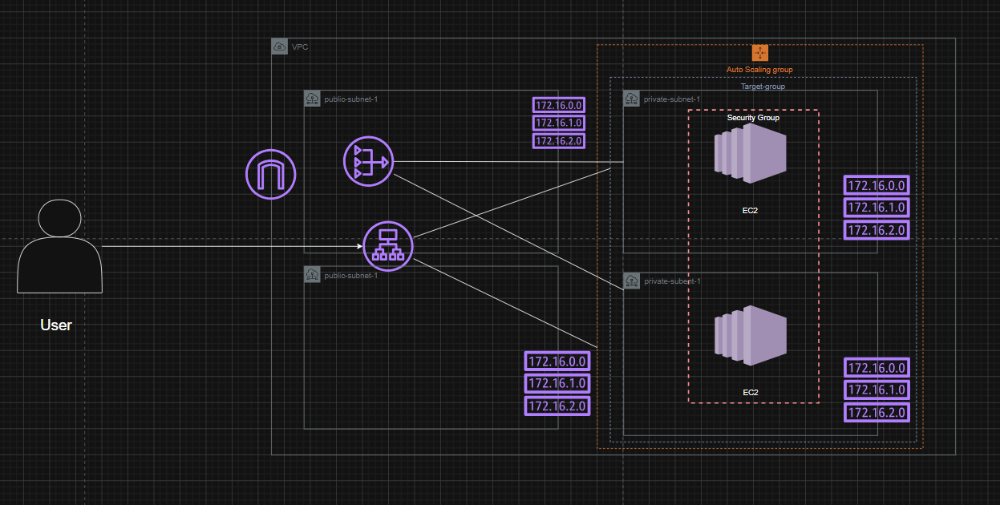

# AWS VPC + ALB + Auto Scaling Group Lab

This lab provisions a small, production-style AWS network from scratch using
Terraform: a VPC with public and private subnets across two Availability
Zones, an Application Load Balancer in front of an Auto Scaling Group of
EC2 instances, and the supporting routing, security, and IAM pieces that
tie it all together.

## Architecture
 



**Traffic flow:** the user hits the ALB over the internet. The ALB (deployed
across both public subnets) forwards HTTP traffic to a target group whose
members are the EC2 instances launched by the Auto Scaling Group inside the
private subnets. The EC2 instances have no public IPs and no direct
internet route — outbound traffic (patches, package installs) leaves through
the NAT Gateway(s) sitting in the public subnets.

## Components created

| Component | Resource(s) | Purpose |
|---|---|---|
| VPC | `aws_vpc.main` | Isolated network, default `172.16.0.0/16` |
| Public subnets (x2) | `aws_subnet.public` | Host the ALB and NAT Gateway(s), one per AZ |
| Private subnets (x2) | `aws_subnet.private` | Host the EC2 instances, one per AZ |
| Internet Gateway | `aws_internet_gateway.igw` | Gives the VPC a path in/out to the internet |
| NAT Gateway(s) + EIP(s) | `aws_nat_gateway.nat`, `aws_eip.nat` | Lets private-subnet instances reach the internet outbound only |
| Public route table | `aws_route_table.public` | Routes `0.0.0.0/0` → Internet Gateway |
| Private route table(s) | `aws_route_table.private` | Routes `0.0.0.0/0` → NAT Gateway |
| ALB security group | `aws_security_group.alb_sg` | Allows inbound HTTP from the internet |
| EC2 security group | `aws_security_group.ec2_sg` | Allows inbound app traffic **only** from the ALB security group |
| IAM role + instance profile | `aws_iam_role.ec2_role`, `aws_iam_instance_profile.ec2_profile` | Grants EC2 instances SSM Session Manager access (no SSH keys/open port 22 needed) |
| Launch Template | `aws_launch_template.app` | Defines the AMI, instance type, security group, IAM profile, and user-data (installs & starts a simple web server) used by the ASG |
| Auto Scaling Group | `aws_autoscaling_group.app` | Keeps 2–4 (configurable) EC2 instances running across both private subnets, registered to the target group |
| Application Load Balancer | `aws_lb.app` | Internet-facing, spans both public subnets |
| Target Group + Listener | `aws_lb_target_group.app`, `aws_lb_listener.http` | Routes HTTP:80 traffic from the ALB to healthy EC2 instances |

## Files

- **`variables.tf`** — all configurable inputs (region, CIDR ranges, instance
  type, ASG sizing, ports, etc.), each with a sensible default so the lab
  can be applied with zero overrides.
- **`main.tf`** — the actual infrastructure: networking, security groups,
  IAM, launch template, ASG, and ALB.
- **`outputs.tf`** — IDs/ARNs/DNS name you'll want after `apply`, most
  importantly `alb_dns_name` to test the app in a browser.

## How to use

```bash
terraform init
terraform plan
terraform apply
```

Once applied, open the value of the `alb_dns_name` output in a browser.
The ALB will load-balance the request across whichever EC2 instance the
Auto Scaling Group placed it on, and you should see a page confirming
which instance served the request.

To tear everything down:

```bash
terraform destroy
```

## Design notes / things worth knowing for the lab

- **CIDR scheme**: VPC `172.16.0.0/16`, split into 4 `/24`s — two public
  (`172.16.0.0/24`, `172.16.1.0/24`) and two private
  (`172.16.2.0/24`, `172.16.3.0/24`). Adjust in `variables.tf` if you need
  different ranges.
- **Cost control**: `single_nat_gateway = true` by default, so only **one**
  NAT Gateway is created (cheaper for a lab). Set it to `false` in
  `variables.tf` if you want one NAT Gateway per AZ for full high
  availability (private subnet in AZ-a won't lose outbound internet if
  AZ-b has an issue, and vice versa).
- **No SSH keys required**: instances get an IAM role with
  `AmazonSSMManagedInstanceCore`, so you can connect via **AWS Systems
  Manager Session Manager** in the console instead of opening port 22.
  If you still want SSH, set the `key_name` variable and open port 22 on
  `ec2_sg` yourself.
- **AMI selection**: the launch template defaults to the latest Amazon
  Linux 2023 AMI (looked up automatically via a data source), overridable
  with the `ami_id` variable.
- **Security groups follow least privilege**: only the ALB security group
  is open to `0.0.0.0/0`; the EC2 security group only accepts traffic
  that originates from the ALB security group, not from the internet or
  any CIDR directly.
- **IMDSv2 enforced** (`http_tokens = "required"`) on the launch template
  as a security best practice.

## Cleanup reminder

This lab creates billable resources (NAT Gateway, ALB, EC2 instances,
Elastic IP). Run `terraform destroy` when you're done to avoid ongoing
charges.
