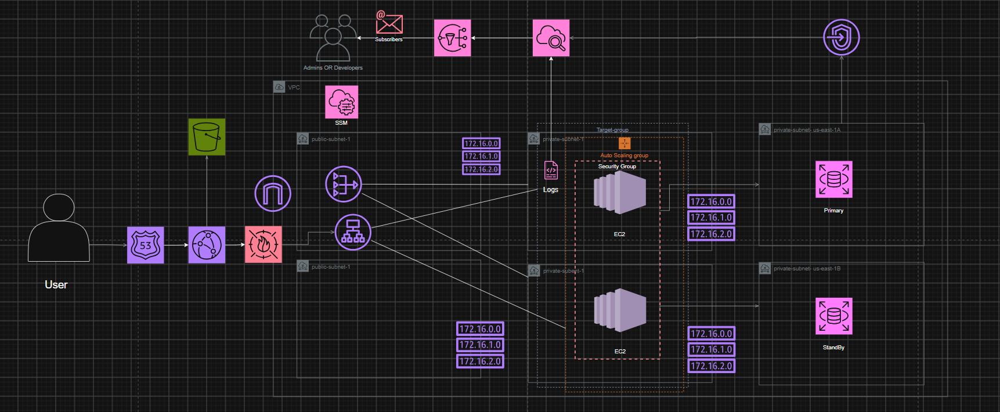

# Scalable Web App — Production-Grade AWS Infrastructure (Terraform)

A highly-available, production-style web application stack deployed on AWS
using Terraform.  The stack includes a two-tier VPC, an internet-facing
Application Load Balancer in front of an Auto Scaling Group of EC2
instances, a Multi-AZ RDS PostgreSQL database, a CloudFront CDN with S3
static-asset origin, WAF protection, and full CloudWatch monitoring with
SNS alerting.

## Architecture


**Traffic flow:**

1. A user request hits the **CloudFront CDN**.
2. If the path matches `/static/*`, CloudFront serves the object from the
   **S3 bucket** (via Origin Access Control — the bucket is never public).
3. Otherwise, CloudFront forwards the request to the **ALB**.
4. The ALB (in the public subnets) forwards HTTP traffic to the **target
   group**, whose members are **EC2 instances** launched by the **Auto
   Scaling Group** in the private subnets.
5. EC2 instances have no public IPs and no direct internet route —
   outbound traffic (package updates, etc.) leaves through the **NAT
   Gateway**.
6. The EC2 instances connect to **RDS PostgreSQL** (Multi-AZ) in the
   private subnets.

## Components

| Layer | Resource(s) | Purpose |
|---|---|---|
| **Networking** | VPC, IGW, 2× public + 2× private subnets, NAT GW + EIP, route tables | Isolated 2-AZ network (`172.16.0.0/16`) |
| **NACLs** | Public NACL, Private NACL | Stateless subnet-level firewall (defense in depth) |
| **Security Groups** | ALB SG, EC2 SG, RDS SG | Stateful firewalls with least-privilege chain: Internet → ALB → EC2 → RDS |
| **IAM** | EC2 role + instance profile | Grants SSM Session Manager access (no SSH keys) |
| **Compute** | Launch template, ALB, target group, ASG, scaling policy | Auto-scaling web tier (2–4 instances, CPU target tracking) |
| **WAF** | Web ACL (4 rules) + ALB association | OWASP Top 10 protection: Common, KnownBadInputs, SQLi managed rules + rate limiting |
| **CDN** | S3 bucket (private), CloudFront OAC, distribution, bucket policy | Edge-cached static assets + dynamic app via ALB origin |
| **Database** | RDS PostgreSQL (Multi-AZ), DB subnet group | Encrypted, automated backups, not publicly accessible |
| **DNS** | Route 53 health check, optional hosted zone + alias record | ALB health monitoring; DNS only when you own a domain |
| **Monitoring** | SNS topic + email, 4 CloudWatch alarms, dashboard | CPU (EC2 + RDS), ALB 5xx, RDS storage alerts; single-pane dashboard |

## File Structure

```
Manara-Project-1/
├── README.md                    # This file
├── .gitignore                   # Terraform + IDE ignores
└── terraform/
    ├── versions.tf              # Terraform & provider version constraints
    ├── providers.tf             # AWS provider config (with default_tags)
    ├── backend.tf               # S3 remote state backend (commented template)
    ├── data.tf                  # Data sources (AZs, AMI) + locals
    ├── vpc.tf                   # VPC, subnets, routing, NAT Gateway
    ├── network-acls.tf          # Public & private NACLs
    ├── security-groups.tf       # ALB, EC2, RDS security groups
    ├── iam.tf                   # EC2 IAM role + SSM policy
    ├── compute.tf               # Launch template, ALB, target group, ASG
    ├── waf.tf                   # WAF Web ACL + ALB association
    ├── cdn.tf                   # S3 bucket, CloudFront, OAC, bucket policy
    ├── database.tf              # RDS PostgreSQL (Multi-AZ)
    ├── dns.tf                   # Route 53 health check + optional records
    ├── monitoring.tf            # SNS, CloudWatch alarms + dashboard
    ├── variables.tf             # All input variables (typed, with defaults)
    ├── outputs.tf               # All output values (25+ outputs)
    ├── terraform.tfvars         # Production variable values (your overrides)
    └── terraform.tfvars.example # Template for terraform.tfvars
```

## Prerequisites

- **Terraform** >= 1.5.0
- **AWS CLI** configured with credentials that have sufficient permissions
  (or use `AWS_ACCESS_KEY_ID` / `AWS_SECRET_ACCESS_KEY` environment variables)
- An **email address** for SNS alarm notifications (you must confirm the
  subscription email AWS sends you)

## How to Use

```bash
# 1. Copy the example variable file and edit it
cp terraform/terraform.tfvars.example terraform/terraform.tfvars
# Edit terraform/terraform.tfvars:
#   - Set rds_master_password to a strong password
#   - Set alert_email to your email address

# 2. Initialize Terraform
terraform -chdir=terraform init

# 3. Review the plan
terraform -chdir=terraform plan

# 4. Apply
terraform -chdir=terraform apply
```

After `apply`, check the outputs for:

- **`cloudfront_domain_name`** — open this in a browser to see the app
- **`alb_dns_name`** — the ALB endpoint (also accessible directly)
- **`rds_endpoint`** — the database connection string (sensitive)

To tear everything down:

```bash
terraform -chdir=terraform destroy
```

## Design Decisions & Best Practices

- **No SSH keys required**: EC2 instances get an IAM role with
  `AmazonSSMManagedInstanceCore`, so you connect via **AWS Systems Manager
  Session Manager** in the console — no open port 22.
- **IMDMv2 enforced** (`http_tokens = "required"`) on the launch template.
- **Least-privilege security groups**: only the ALB SG is open to the
  internet; the EC2 SG only accepts traffic from the ALB SG; the RDS SG
  only accepts Postgres from the EC2 SG.
- **WAF with OWASP managed rules**: Common Rule Set, Known Bad Inputs,
  SQLi, plus per-IP rate limiting.
- **S3 static assets are private**: served exclusively through CloudFront
  via Origin Access Control (OAC) — never directly public.
- **RDS is not publicly accessible**: deployed in private subnets with
  encrypted storage and automated backups.
- **Single NAT Gateway by default** (`single_nat_gateway = true`) to save
  costs. Set to `false` for one NAT GW per AZ (full HA).
- **Remote state backend**: `backend.tf` includes a commented S3 + DynamoDB
  template. Uncomment and configure for production to enable state locking.
- **Default tags**: the provider applies `var.tags` to every resource
  automatically via `default_tags`.

## Cost Control

This stack creates billable resources (NAT Gateway, ALB, EC2 instances,
RDS, CloudFront, WAF).  Run `terraform destroy` when you're done to avoid
ongoing charges.  Consider switching to smaller instance classes
(`t3.nano` / `db.t3.micro`) or enabling `single_nat_gateway = true` for
lab use.
