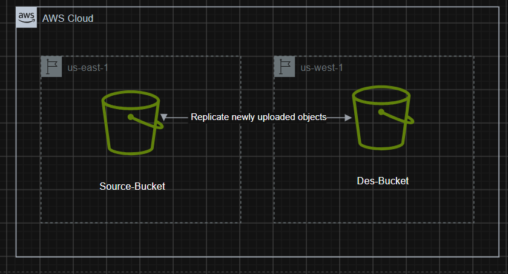

# S3 Cross-Region Replication (CRR)

A Terraform project that sets up **cross-region replication** between two S3
buckets in different AWS regions.

## What it does

1. Creates a **source bucket** in one region (with versioning + private ACL).
2. Creates a **destination bucket** in another region (with versioning).
3. Creates an **IAM role & policy** that grants S3 permission to replicate
   objects, object ACLs, and object tags from source → destination.
4. Attaches a **replication configuration** to the source bucket that copies
   objects under a given key prefix to the destination bucket.

## Architecture



## File structure

```
S3-CRR/
├── README.md              # This file
└── terraform/
    ├── providers.tf       # AWS provider configs  (source +destination regions) 
    ├── s3.tf              # S3 buckets, IAM role/policy, versioning , ACL 
    ├── replication.tf     # Bucket replication configuration
    ├── variables.tf       # All input variables (human-readable names)
    └── outputs.tf         # Output values
```

## Prerequisites

- **Terraform** >= 1.5.0
- **AWS CLI** configured with credentials that have permission to create S3
  buckets, IAM roles/policies, and replication configurations
- Two **globally unique** bucket names (S3 bucket names are unique across all
  AWS accounts)

## Usage

```bash
# 1. (Optional) override defaults in a tfvars file
cat > terraform/terraform.tfvars <<EOF
source_bucket_name      = "my-unique-source-bucket"
destination_bucket_name = "my-unique-dest-bucket"
source_region           = "us-east-1"
destination_region      = "us-west-2"
EOF

# 2. Initialize
terraform -chdir=terraform init

# 3. Review the plan
terraform -chdir=terraform plan

# 4. Apply
terraform -chdir=terraform apply
```

To tear everything down:

```bash
terraform -chdir=terraform destroy
```

## Variables

| Variable | Description | Default |
|---|---|---|
| `source_region` | Region of the source bucket | `eu-central-1` |
| `destination_region` | Region of the destination bucket | `eu-west-1` |
| `replication_role_name` | IAM role name for replication | `tf-iam-role-replication-12345` |
| `replication_policy_name` | IAM policy name for replication | `tf-iam-role-policy-replication-12345` |
| `source_bucket_name` | Source bucket name | `tf-test-bucket-source-12345` |
| `destination_bucket_name` | Destination bucket name | `tf-test-bucket-destination-12345` |
| `replication_rule_id` | Replication rule identifier | `examplerule` |
| `replication_prefix` | Key prefix the rule applies to | `example` |
| `replication_storage_class` | Storage class for replicated objects | `STANDARD` |

## Outputs

| Output | Description |
|---|---|
| `source_bucket_id` | ID of the source bucket |
| `source_bucket_arn` | ARN of the source bucket |
| `destination_bucket_id` | ID of the destination bucket |
| `destination_bucket_arn` | ARN of the destination bucket |
| `replication_role_arn` | ARN of the replication IAM role |
| `replication_configuration_id` | ID of the replication configuration |

## Notes

- **Versioning is required** on both buckets before replication can be
  configured. This project enables it automatically.
- The source bucket is created with `provider = aws.central` (the source
  region), while the destination bucket uses the default provider (destination
  region).
- Bucket names must be unique across all of AWS — change the defaults before
  applying.
