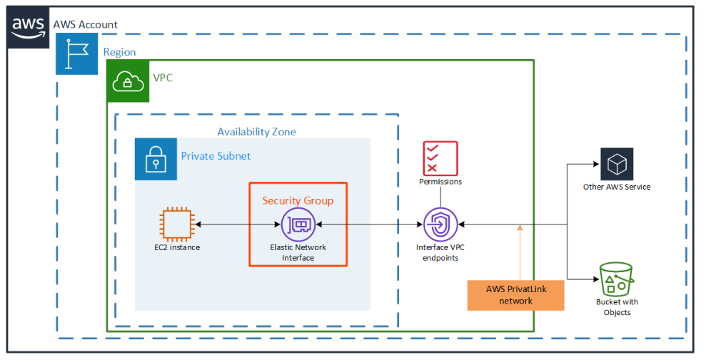

# VPC Endpoint Lab: Private EC2 Access to AWS APIs



## Goal
This lab creates a private-only AWS networking scenario that demonstrates how an Amazon EC2 instance in a private subnet can reach AWS APIs over an interface VPC endpoint without using a NAT gateway or an Internet Gateway.

## What this Terraform creates
- A VPC named `network-lab-vpc`
- One private subnet named `network-lab-private-subnet`
- One Amazon Linux EC2 instance in the private subnet
- An IAM role attached to the instance with `AmazonEC2FullAccess` and `AmazonSSMManagedInstanceCore`
- Interface VPC endpoints for EC2, SSM, SSMMessages, and EC2Messages
- Security groups that allow the instance to talk to the VPC endpoints over HTTPS

## Architecture idea
- The EC2 instance is placed in a private subnet.
- No NAT gateway or Internet Gateway is used.
- The instance reaches AWS API endpoints through the interface VPC endpoint over port 443.
- This is a common pattern for private workloads that need AWS API access while staying off the public internet.

## Prerequisites
- AWS account
- Terraform installed locally
- AWS CLI configured with credentials
- Permission to create VPCs, subnets, EC2 instances, IAM roles, and VPC endpoints

## Deploy the lab
1. Change into the lab directory:
   ```bash
   cd VPC-Endpoints
   ```
2. Initialize Terraform:
   ```bash
   terraform init
   ```
3. Review the plan:
   ```bash
   terraform plan
   ```
4. Apply the configuration:
   ```bash
   terraform apply
   ```

## Verify the behavior
Once the infrastructure is created, connect to the EC2 instance through AWS Systems Manager Session Manager from the AWS console.

### Console-based access
1. Open the EC2 console.
2. Select the private instance.
3. Choose Connect.
4. Use Session Manager.

The instance should connect successfully because the SSM, SSMMessages, and EC2Messages interface endpoints are available inside the VPC.

### CLI test from inside the instance
From the EC2 instance, test access to the AWS API without a NAT gateway:

```bash
aws ec2 describe-instances --region us-east-1
```

Expected result:
- The command should succeed if the instance can reach the EC2 API through the VPC endpoint.
- You should not need a NAT gateway or Internet Gateway for this test.

## Important notes
- The EC2 instance is private and does not get a public IP address.
- This lab is focused on proving the VPC endpoint path for AWS API calls.
- For production environments, you should also consider additional controls such as endpoint policies, private DNS, and least-privilege IAM permissions.

## Clean up
Remove the resources when you are done:

```bash
terraform destroy
```
