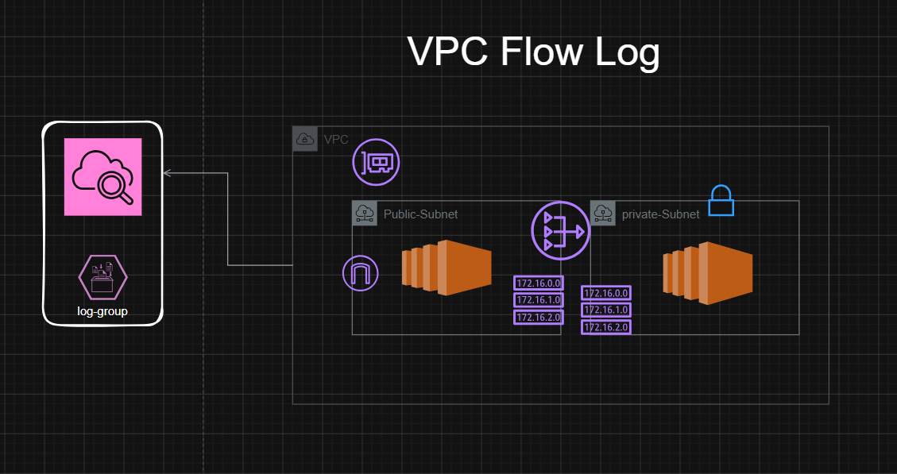

# VPC Flow Log Demo



This tutorial demonstrates how to create a small, reusable Terraform configuration to deploy a VPC with a public and private subnet, an Internet Gateway, a NAT Gateway, an EC2 Ubuntu instance in the public subnet, a CloudWatch Log Group, an IAM role for VPC Flow Logs, and a VPC Flow Log that sends logs to CloudWatch.

Files:
- terraform/: Terraform configuration (main.tf, variables.tf, outputs.tf)
- design.png: architecture diagram

Highlights:
- `demo-vpc-flow-log` VPC with one public and one private subnet
- Route table and IGW association for public subnet
- NAT Gateway in public subnet, private subnet routes through NAT
- `demo-flow-log-role` IAM role and policy to allow flow logs to write to CloudWatch
- CloudWatch Log Group `/aws/vpc/<vpc-id>/flow-logs`
- VPC Flow Log resource capturing `ALL` traffic

Usage:
1. Change into the `terraform` directory:

```powershell
cd "VPC-FlowLog\terraform"
```

2. Initialize and apply (ensure your AWS credentials are configured):

```powershell
terraform init
terraform apply
```

3. After apply, review outputs for resource IDs and endpoints.

Notes:
- Variables are in `variables.tf` and can be overridden with `-var` or a `tfvars` file.
- The included `design.png` illustrates the VPC, subnets, EC2, NAT, and CloudWatch log group.
- This is intended for demo / lab use. Review and tighten IAM and security group rules before production use.

AWS-SAA context:
This tutorial aligns with AWS Well-Architected: it demonstrates separation of public/private subnets, usage of NAT for egress, monitoring via VPC Flow Logs to CloudWatch, and least-privilege IAM roles for the flow log service.
