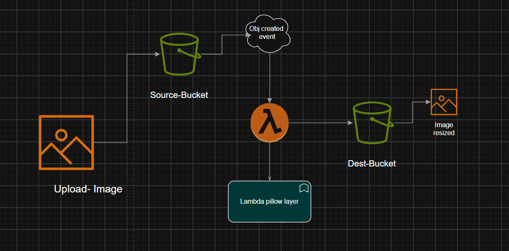

# AWS Lambda Thumbnail Generator

A serverless image thumbnail generator built with AWS Lambda, Amazon S3, Lambda Layers (Pillow), and Terraform.

---

## Architecture





---

## Technologies

- AWS Lambda
- Amazon S3
- Lambda Layers
- IAM
- Terraform
- Python 3.12
- Pillow

---

## Project Structure

```text
lambda-project/
│
├── lambda/
│   ├── libraries.zip
│   └── thumbnail-generator.zip
│
├── main.tf
├── variables.tf
├── outputs.tf
└── terraform.tfvars
```

---

## Terraform Resources

| Resource | Purpose |
|----------|---------|
| S3 Source Bucket | Stores uploaded images |
| S3 Destination Bucket | Stores generated thumbnails |
| IAM Role | Lambda execution role |
| IAM Policy | S3 and CloudWatch permissions |
| Lambda Layer | Pillow dependency |
| Lambda Function | Generates thumbnails |
| Lambda Permission | Allows S3 to invoke Lambda |
| S3 Notification | Triggers Lambda on upload |

---

## Workflow

1. Upload an image to the source bucket.
2. S3 triggers the Lambda function.
3. Lambda downloads the image.
4. Pillow resizes the image.
5. Lambda uploads the thumbnail to the destination bucket.

---

## Terraform Commands

```bash
terraform init
terraform plan
terraform apply
terraform destroy
```

---

## Outputs

| Output | Description |
|--------|-------------|
| source_bucket | Source S3 bucket |
| destination_bucket | Destination S3 bucket |
| lambda_name | Lambda function name |
| lambda_arn | Lambda function ARN |
| lambda_role | IAM role ARN |
| layer_arn | Lambda Layer ARN |

---

## Author

**Yousef Ahmed Maher**