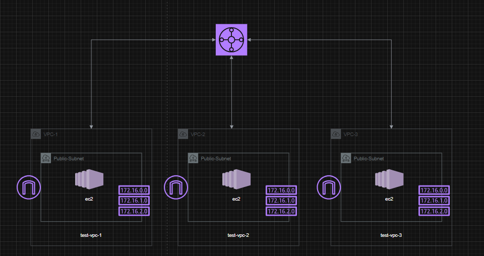

# VPC Transit Gateway Lab



## Overview

This lab builds **3 separate VPCs**, each with its own public subnet, Internet
Gateway, route table, security group and a single EC2 instance running Nginx.
A **Transit Gateway (TGW)** is then created and attached to all three VPCs so
that they can route traffic to each other privately, without going through
the public internet.

## What gets created

| Component | Count | Notes |
|---|---|---|
| VPC | 3 | `10.0.0.0/16`, `12.0.0.0/16`, `14.0.0.0/16` |
| Public Subnet | 3 | One per VPC |
| Internet Gateway | 3 | One per VPC (internet access for each EC2) |
| Route Table | 3 | Public route (`0.0.0.0/0` -> IGW) + TGW routes |
| Security Group | 3 | Allows HTTP (80) from anywhere, SSH (22) from `allowed_ssh_cidr` |
| EC2 Instance | 3 | Amazon Linux 2023, Nginx installed via `user_data` |
| Transit Gateway | 1 | Central hub connecting all 3 VPCs |
| TGW VPC Attachment | 3 | One attachment per VPC subnet |
| Routes to TGW | 6 | Each VPC gets a route to the other two VPCs' CIDRs via the TGW |

## Files

- `main.tf` – VPCs, subnets, IGWs, route tables, security groups, EC2 instances
- `variables.tf` – input variables (region, CIDRs, instance type, etc.)
- `outputs.tf` – VPC/subnet IDs and EC2 public IPs
- `design.png` – architecture diagram of the lab

## How it works

1. Each VPC has its own Internet Gateway for **outbound/inbound internet
   access** (so you can SSH into each instance and reach it over HTTP).
2. The Transit Gateway acts as a **central router**. Each VPC attaches to it
   through its public subnet.
3. Extra routes are added to each VPC's route table so that traffic destined
   for **another VPC's CIDR block** is sent to the Transit Gateway instead of
   the Internet Gateway.
4. Result: the 3 EC2 instances can reach each other over their **private IPs**
   through the TGW, while still keeping normal internet access through their
   own IGWs.

## Usage

```bash
terraform init
terraform plan
terraform apply
```

After apply, grab the outputs:

```bash
terraform output
```

Then SSH into one instance and curl the private IP of another to confirm the
Transit Gateway routing works, e.g.:

```bash
curl http://<private-ip-of-other-instance>
```

## Cleanup

```bash
terraform destroy
```
