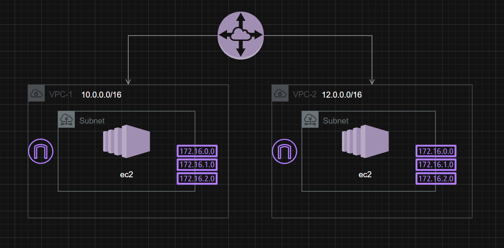

# VPC Peering Lab


This lab provisions a simple AWS networking environment with two VPCs, two public subnets, two EC2 instances, internet gateways, and a VPC peering connection.

## Architecture Overview

The design is based on the provided image and includes:
- VPC 1 with a public subnet and an EC2 instance
- VPC 2 with a public subnet and an EC2 instance
- One internet gateway in each VPC
- A VPC peering connection between VPC 1 and VPC 2
- Route tables that allow both VPCs to reach each other and the internet
- Security groups that allow HTTP and SSH access

## What This Terraform Configuration Creates

- Two VPCs with CIDR blocks:
  - VPC 1: 10.0.0.0/16
  - VPC 2: 12.0.0.0/16
- Two public subnets:
  - VPC 1 subnet: 10.0.50.0/24
  - VPC 2 subnet: 12.0.50.0/24
- Two Amazon Linux 2023 EC2 instances with public IPs
- Nginx installed via user data on both instances
- A VPC peering connection with route table entries for inter-VPC communication

## VPC Peering Concepts

VPC peering allows two VPCs to communicate privately over the AWS network. In this lab:
- The peering connection is established between VPC 1 and VPC 2.
- Route tables in each VPC include a route to the peer VPC CIDR block.
- Security groups allow inbound HTTP and SSH traffic.
- The instances can be reached publicly through their Elastic IP-style public IP assignment.

## Terraform Infrastructure Notes

This configuration is written to be readable and reusable:
- Variables are defined in the variables file for easy customization.
- Resources are named clearly and consistently.
- Outputs are exposed so you can retrieve the EC2 public IPs and peering connection ID.
- User data is used to install and start Nginx automatically.

## Usage

1. Change into the Terraform directory:
   ```bash
   cd terraform
   ```
2. Initialize Terraform:
   ```bash
   terraform init
   ```
3. Review the plan:
   ```bash
   terraform plan
   ```
4. Apply the configuration:
   ```bash
   terraform apply
   ```

## Outputs

After deployment, Terraform will output:
- VPC IDs
- Subnet IDs
- Public IP addresses for both EC2 instances
- The VPC peering connection ID
